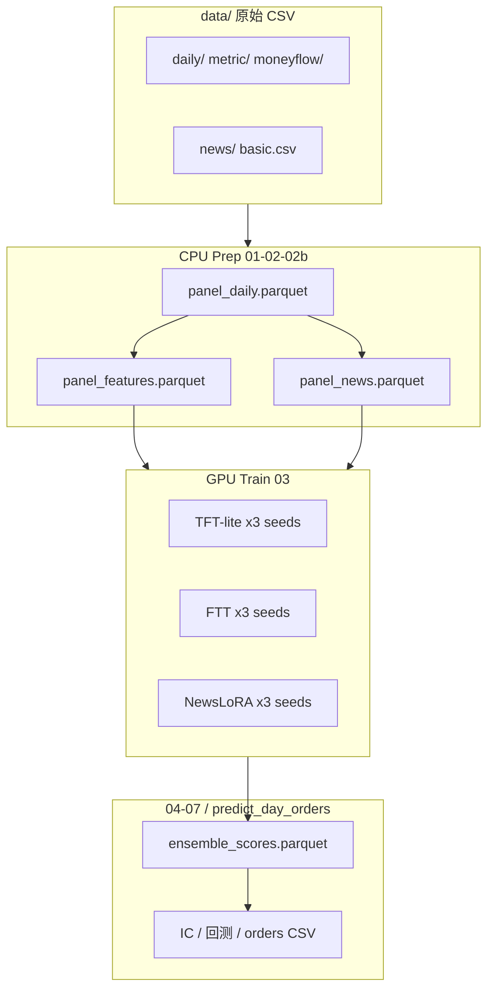

# TFNE · A 股多模态深度学习趋势预测与模拟交易

[](https://www.python.org/)
[](https://pytorch.org/)
[]()

**仓库地址：** https://github.com/Maodawang66/tfne-a-share

中国科学技术大学《深度学习基础》课程大作业完整工程。在除 ST、北交所外的 A 股 universe 上，融合**价量时序、基本面/资金流截面、新闻文本**三类信息，用深度学习模型输出横截面排序分数，经**目标权重策略**生成调仓建议，并完成 **IC/ICIR、策略 IC@K、成本后回测** 与同花顺 **FDL2026** 模拟交易对接。

- **主实验档位 C2（TFNE-C2）**：TFT-lite + FT-Transformer + NewsLoRA（`hfl/chinese-roberta-wwm-ext`），Top3000 流动性池，3 seed 秩融合，策略 **每日最多 10 只股票**。
- **对照档位 A（RGNE-Lite）**：GRU + TabMLP + 新闻哈希，Top500，适合本机 6GB GPU 调试全流程。

更细的操作手册（数据上传、服务器 conda、十只策略出单验证）见 [**code/README.md**](code/README.md)。

---

## 目录

- [任务与评价口径](#任务与评价口径)
- [方法概览](#方法概览)
- [系统架构](#系统架构)
- [仓库结构](#仓库结构)
- [数据说明](#数据说明)
- [环境与安装](#环境与安装)
- [流水线详解](#流水线详解)
- [策略与出单](#策略与出单)
- [产物路径](#产物路径)
- [服务器部署](#服务器部署)
- [未纳入 Git 的内容](#未纳入-git-的内容)
- [文档索引](#文档索引)
- [常见问题](#常见问题)
- [声明与作者](#声明与作者)

---

## 任务与评价口径

| 环节 | 课程 / 项目要求 | 本仓库实现 |
|------|-----------------|------------|
| 预测目标 | 用过去 \(L\) 日特征预测未来短期收益方向/排序 | 标签 `excess_ret_1d`，Huber 回归 + 截面排序评估 |
| 模型 | 必须含神经网络，可多模型 | A：GRU+MLP+Hash；C2：TFT+FTT+LoRA |
| 股票池 | 全 A（除 ST、北交所）；可先用子集 | C2：流动性 Top3000；A：Top500 |
| 交易 | T+1、尽量满仓、模拟盘出单 | `src/strategy.py` + `orders_YYYYMMDD.csv` |
| 评估 | IC、ICIR、回测夏普/回撤 | `05_evaluate_ic.py`、`06_backtest.py` |
| 防泄露 | 禁止未来信息、禁止全样本 fit 标准化 | walk-forward 切分 + **逐期截面秩**（GKX 风格） |

**时间切分（C2，`config.server_c2_72h.yaml`）：**

- 训练：`trade_date ≤ 20250331`
- 验证（报告只报 valid）：`20250401` – `20260520`
- `test_end: null`（不设 test 回测段）
- FDL2026 模拟赛 `2026-06-01` ~ `06-10` 为**样本外**，仅通过 `predict_day_orders.py` 出单，不计入 IC/回测指标

---

## 方法概览

### 三模态预测

1. **时序模态（Seq）**  
   过去 `seq_len=60` 个交易日的价量/技术序列 → **TFT-lite**（C2）或 **GRU**（A）→ 每只股票的时序分数。

2. **截面模态（Tab）**  
   当日基本面、资金流、规模、行业等表格特征 → **FT-Transformer**（C2）或 **MLP**（A）→ 截面分数。

3. **新闻模态（News）**  
   东方财富日度快讯链指到股票 → **NewsLoRA**（C2，RoBERTa + LoRA）或 **哈希袋**（A）→ 文本分数。

### 融合与风控

- 各模态、多种子 checkpoint 在验证集上算 **Spearman IC**，按 ICIR 估计**静态模态权重**（`fusion_weights.json`）。
- 推理时对分数做截面秩融合，可选 **Sharpe 型风险调整**（`risk_score.py`）压低高波动标的分数。
- 策略层：`score ≥ Q(0.90)` 后取 Top **`n_max`**（C2 为 **10**），秩加权 + 单票/行业上限 + 换手上限 → `target_weight`。

---

## 系统架构



**模块分层（`code/src/`）：**

| 层级 | 职责 | 主要文件 |
|------|------|----------|
| 配置 | YAML → 路径、`tier_tag`、超参 | `config.py`、`config.*.yaml` |
| 数据 | 面板、GKX 特征、新闻链指、Dataset | `panel.py`、`features.py`、`dataset.py`、`incremental_prep.py` |
| 模型 | 按档位构建 Seq/Tab/News | `models/factory.py`、`seq_model.py`、`tab_model.py`、`news_model.py` |
| 训练 | AMP、早停、checkpoint | `train/trainer.py` |
| 融合 | 多 seed 均值 + ICIR 定权 | `ensemble.py` |
| 策略/回测 | 目标权重、T+1、涨跌停 | `strategy.py`、`backtest.py` |

档位 A 与 C2 **共用** `src/` 与 `01`–`07` 脚本，通过 `--config` 切换；checkpoint 与 metrics 分别落在 `artifacts/*/tier_a/`、`tier_c2/`。**注意：** `panel_daily.parquet` 无 tier 前缀，后跑的 prep 会覆盖，A/C2 不要混用不同 TopK 的 prep 期望。

---

## 仓库结构

```text
tfne-a-share/
├── README.md                 # 本文件（GitHub 项目总览）
├── .gitignore
├── code/                     # ★ 主工程目录（所有命令在此执行）
│   ├── config.server_c2_72h.yaml
│   ├── config.tier_a_local.yaml
│   ├── scripts/              # 01–07、run_server_c2_72h、predict_day_orders
│   ├── src/                  # 核心库
│   ├── docs/                 # ARCHITECTURE、USTC Slurm 指南
│   ├── requirements.txt
│   ├── requirements-nlp.txt
│   └── README.md             # 详细运行手册
├── data/                     # 原始 CSV（日频大目录未入库）
│   ├── README.md             # 字段说明
│   ├── basic.csv / trade_cal.csv
│   └── market/               # 指数 benchmark
├── report.tex                # 实验报告 LaTeX
├── 讨论报告.md / 项目方案.md / 设想.md
├── tier_a_project/           # 档位 A 报告配图
└── tier_c2_project/           # 档位 C2 报告配图
```

---

## 数据说明

原始数据**不由本仓库自动下载**，需按 [`data/README.md`](data/README.md) 放置。目录约定（相对项目根 `tfne-a-share/`）：

| 路径 | 内容 | 是否入库 |
|------|------|----------|
| `data/basic.csv` | 股票列表、行业、上市日 | ✅ |
| `data/trade_cal.csv` | 交易日历 | ✅ |
| `data/market/*.csv` | 上证/沪深300/创业板指数 | ✅ |
| `data/daily/YYYYMMDD.csv` | 日频 OHLCV、成交额等 | ❌（约 GB 级） |
| `data/metric/` | PE/PB、市值、换手率等 | ❌ |
| `data/moneyflow/` | 大中小单资金流 | ❌ |
| `data/news/` | 东方财富快讯（2019 起） | ❌ |
| `data/stock_st/` | 每日 ST 名单 | ❌ |

**增量更新（模拟盘 / nightly）：** 每个交易日收盘后，将新一天的 `daily/`、`metric/`、`moneyflow/`、`news/` 等 CSV 放入对应目录，再执行 `prep-inc`（见下文）。

---

## 环境与安装

### 本机（Windows / Linux）

```bash
git clone https://github.com/Maodawang66/tfne-a-share.git
cd tfne-a-share/code

conda create -n ai25 python=3.10 -y
conda activate ai25
pip install -r requirements.txt
pip install -r requirements-nlp.txt   # C2 必须：transformers, peft
```

**硬件建议：**

| 档位 | GPU 显存 | 说明 |
|------|----------|------|
| A | ≥ 6GB | 本机笔记本可跑通 Top500 |
| C2 训练 | ≥ 16GB，推荐 24GB+ | 3 seed × TFT/FTT/LoRA |
| C2 nightly 推理 | ≥ 6GB | 仅 `predict_day_orders`，约 15–30 min/日 |

### 中科大本科生算力平台

登录节点一次性配置（Miniforge + 环境 `ai25`）：

```bash
bash /home/scc/pb23151824/pro/code/scripts/setup_server_ai25.sh
```

日常激活：

```bash
source /home/scc/pb23151824/miniforge3/etc/profile.d/conda.sh
conda activate ai25
cd /home/scc/pb23151824/pro/code
export HF_ENDPOINT=https://hf-mirror.com
```

详见 [**code/docs/USTC_SLURM_PREP.md**](code/docs/USTC_SLURM_PREP.md)。

---

## 流水线详解

所有脚本在 **`code/`** 下执行，且必须显式传入 `--config`（无默认 `config.yaml`）。

| 步骤 | 脚本 | 作用 | 典型耗时 |
|------|------|------|----------|
| 01 | `01_build_panel.py` | 合并日频 → `panel_daily.parquet` | 全量：小时级 |
| 02 | `02_make_features.py` | GKX 变换、时序/截面特征 | 全量：约 20–25 min |
| 02b | `02b_embed_news.py` | 新闻链指 → `panel_news.parquet` | 视新闻量 |
| 03 | `03_train_{tft,ftt,news_lora}.py` | 分模态训练，保存 `best.pt` | C2：28–42 h（服务器） |
| 04 | `04_ensemble_predict.py` | 多 seed 融合 → `ensemble_scores.parquet` | 小时级 |
| 05 | `05_evaluate_ic.py` | IC / ICIR / `strategy_topk.json` | 分钟级 |
| 06 | `06_backtest.py` | valid 回测净值与指标 | 分钟级 |
| 07 | `07_predict_latest.py` | 按 scores 最新日写订单 | 秒级 |
| — | `prep_incremental.py` | **仅追加**新交易日 panel/features/news | 2–5 min/日 |
| — | `predict_day_orders.py` | **指定 signal 日**推理 + 出单（nightly 推荐） | 15–30 min/日 |

### 一键入口

```bash
# C2：prep | prep-inc | train | eval | all
python scripts/run_server_c2_72h.py prep
python scripts/run_server_c2_72h.py train
python scripts/run_server_c2_72h.py eval

# A：本机全流程
python scripts/run_tier_a_local.py
```

### 档位对比

| 项目 | 档位 A | 档位 C2 |
|------|--------|---------|
| 配置文件 | `config.tier_a_local.yaml` | `config.server_c2_72h.yaml` |
| 时序模型 | GRU hidden=64 | TFT-lite hidden=128 |
| 截面模型 | MLP | FT-Transformer 4 blocks |
| 新闻 | 哈希袋（无 BERT） | RoBERTa + LoRA r=8 |
| seeds | 1（42） | 3（42, 123, 456） |
| 股票池 | Top 500 | Top 3000 |
| `n_max` | 30 | **10** |
| NLP 依赖 | 仅 `requirements.txt` | + `requirements-nlp.txt` |

---

## 策略与出单

### 策略逻辑（`src/strategy.py`）

1. **可交易池**：剔除 ST、北交所、停牌、上市 &lt; 60 日、成交额 MA20 过低。  
2. **分数过滤**：`score ≥ quantile(0.90)`。  
3. **选股**：取得分最高的 **`n_max` 只**（C2 配置为 10）。  
4. **权重**：秩变换 + softmax 型加权，叠加单票 `w_max`、行业 `w_ind_max`、高市场波动减仓等约束。  

**含义说明：** `n_max=10` 表示组合**最多持有 10 只股票**，不是「每天固定换 10 只」的 PDF Top-k 换手规则；实际买卖笔数由权重变化与 `delta`、`omega_max` 控制。

### 生成 10 只调仓单（C2）

**前置：** `artifacts/checkpoints/tier_c2/` 已有训练权重；`panel_features.parquet` 含目标 signal 日。

```bash
cd code
conda activate ai25

# 若有新交易日数据
python scripts/run_server_c2_72h.py prep-inc

# 推理 + 写订单（默认 signal 日 = panel 最大 trade_date）
python scripts/predict_day_orders.py --config config.server_c2_72h.yaml --buf-days 70
```

**输出：** `code/artifacts/orders/tier_c2/orders_YYYYMMDD.csv`

```csv
ts_code,target_weight,trade_date
600519.SH,0.1023,20260525
...
```

- `trade_date` = 信号日 **T**（T 日收盘信息）  
- **T+1 开盘**按 `target_weight` 调仓  
- 数据行数应 **≤ 10**，权重和 ≈ 1  

**验证（PowerShell）：**

```powershell
(Import-Csv "code\artifacts\orders\tier_c2\orders_20260525.csv").Count
```

若仍约 50 行，多为改 `n_max` 之前的旧文件，需用上述命令重跑且确认带了 `--config config.server_c2_72h.yaml`。

修改持仓只数：只改 YAML 中 `strategy.n_max`，**无需重训模型**；报告用 IC@K 需重跑 `05`/`06`。

---

## 产物路径

路径均相对 `code/`，按 `tier_tag` 分子目录：

| 类型 | 路径 |
|------|------|
| 面板/特征 | `artifacts/panel_daily.parquet`、`artifacts/features/panel_features.parquet` |
| Checkpoint | `artifacts/checkpoints/tier_c2/{tft,ftt,news}/seed_*/best.pt` |
| 融合分数 | `artifacts/predictions/tier_c2/ensemble_scores.parquet` |
| 融合权重 | `artifacts/predictions/tier_c2/fusion_weights.json` |
| IC 汇总 | `artifacts/metrics/tier_c2/ic_summary.json` |
| 策略 IC@K | `artifacts/metrics/tier_c2/strategy_topk.json` |
| 回测 | `artifacts/backtest/tier_c2/valid/metrics.json` |
| **调仓单** | `artifacts/orders/tier_c2/orders_YYYYMMDD.csv` |

---

## 服务器部署

**Slurm 提交（C2）：**

```bash
sbatch scripts/slurm_prep_cpu_c2_72h.sbatch    # CPU prep
sbatch scripts/slurm_train_gpu_c2_72h.sbatch   # GPU train + 依赖安装
```

Web 表单整段命令：`scripts/web_c2_prep_command.sh`、`web_c2_gpu_command.sh`、`web_c2_eval_command.sh`。

**从 GitHub 克隆到服务器：**

```bash
cd /home/scc/pb23151824/pro
git clone https://github.com/Maodawang66/tfne-a-share.git repo   # 或 git pull
# 将 code/ 与已有 data/、artifacts/ 对齐；大文件 data 与 artifacts 仍需单独备份/拷贝
```

---

## 未纳入 Git 的内容

[`.gitignore`](.gitignore) 已排除约 **9GB** 体量，避免超出 GitHub 单文件 ~100MB 限制：

- `data/daily/`、`metric/`、`moneyflow/`、`news/`、`stock_st/`  
- `code/artifacts/`（parquet、`.pt`、订单、回测结果）  
- `*.tar.gz`、LaTeX 中间文件、Slurm 日志  

**克隆后首次使用：** 恢复或拷贝 `data/` 日频目录 → 运行 `prep`；或从服务器备份恢复 `artifacts/checkpoints/` 与 `panel_features.parquet`。

---

## 文档索引

| 文档 | 说明 |
|------|------|
| [**code/README.md**](code/README.md) | 数据拉取、环境、§五 十只策略现状与逐步出单 |
| [**code/docs/ARCHITECTURE.md**](code/docs/ARCHITECTURE.md) | 数据流图、模块、逐文件索引 |
| [**code/docs/USTC_SLURM_PREP.md**](code/docs/USTC_SLURM_PREP.md) | Miniforge、`ai25`、prep/train 提交 |
| [**code/docs/USTC_SUBMIT_SIMPLE.md**](code/docs/USTC_SUBMIT_SIMPLE.md) | 档位 A 图形界面提交 |
| [**code/docs/TIER_A_LOCAL.md**](code/docs/TIER_A_LOCAL.md) | 本机 6GB 跑档位 A |
| [**data/README.md**](data/README.md) | 原始 CSV 字段 |
| [**设想.md**](设想.md) | C2 72h 预算与方案 |
| [**项目方案.md**](项目方案.md) | 完整项目方案 v2 |

---

## 常见问题

**Q：克隆后没有 `data/daily/`，跑不起来？**  
A：日频数据未入库。从课程数据包或本机备份拷入 `data/`，再 `python scripts/run_server_c2_72h.py prep`。

**Q：`orders_*.csv` 有 50 行不是 10 行？**  
A：旧产物。确认 `config.server_c2_72h.yaml` 中 `n_max: 10`，重跑 `predict_day_orders.py` 并检查终端 `n=10`。

**Q：C2 和 A 的 prep 能混用吗？**  
A：`panel_daily.parquet` 共享，Top500 与 Top3000 prep 会互相覆盖。正式 C2 实验请用 C2 配置单独 prep。

**Q：服务器 `conda: command not found`？**  
A: 先 `source .../miniforge3/etc/profile.d/conda.sh`，再 `conda activate ai25`。

**Q：如何只更新 GitHub 上的代码？**  
A：本地 `git add` → `git commit` → `git push`；`data/` 与 `artifacts/` 仍建议网盘/服务器维护。

---

## 声明与作者

本项目为**课程学习与研究用途**，不构成任何投资建议。复现请遵守课程数据使用规定，勿将数据或模型用于未经授权的商业用途。若使用 AI 工具辅助报告撰写，请在报告中如实标注。

**作者：** [Maodawang66](https://github.com/Maodawang66) · 中国科学技术大学  

**引用本仓库：**

```bibtex
@misc{tfne-a-share2026,
  author = {Maodawang66},
  title  = {TFNE: Multimodal Deep Learning for A-Share Trend Prediction and Simulation},
  year   = {2026},
  url    = {https://github.com/Maodawang66/tfne-a-share}
}
```
