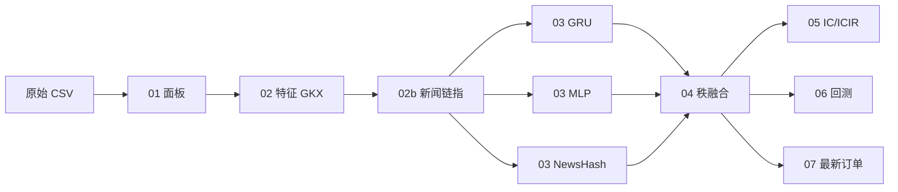

# 档位 A 独立项目：RGNE-Lite 基线实验

> **项目名称**：Rank-GRU + TabMLP + NewsHash 秩融合集成（RGNE-Lite）  
> **定位**：深度学习基础大作业 **可独立提交、可本机复现** 的完整基线方案  
> **代码根目录**：`C:\Users\Lenovo\Desktop\deep learning\pro\code`  
> **数据目录**：`C:\Users\Lenovo\Desktop\deep learning\pro\data`  
> **实验报告**：同目录 [`实验报告.md`](./实验报告.md)

---

## 一、与大作业 PDF 的对应关系

| 大作业要求 | 本方案实现 |
|------------|------------|
| 数据处理 → 特征 → 神经网络 → 策略 → 回测 | 脚本 `01`–`07` 全流程 |
| 必须使用深度学习 | GRU + MLP + 新闻哈希 MLP |
| 可使用多模型联合打分 | 三模态秩融合 + ICIR 定权 |
| 过滤 ST、北交所 | `01_build_panel.py` |
| 禁止未来信息 / 禁止全样本标准化 | 逐日截面 winsorize + 秩→[-1,1]（GKX） |
| 按时间划分训练/验证 | train ≤ 20240630，valid 20240701–20241231 |
| IC、ICIR | `05_evaluate_ic.py` |
| 年化收益、夏普、最大回撤 | `06_backtest.py` |
| 尽可能满仓、T+1 | `src/strategy.py` 目标权重 + 可卖标记 |
| 最新日预测 | `07_predict_latest.py` → `orders_*.csv` |

**与 PDF 示例的差异（已在报告中说明）**：

- 股票池：本机采用 **流动性 Top 500**（算力约束），非全市场 5000 只。
- 策略：在 PDF「Top-n / 卖 k 买 k」思想基础上，实现 **目标权重组合**（分数 softmax 加权 + 行业/单票 cap + 现金下限），更易满足「尽可能满仓」。
- 测试集：数据止于 2024-12-31，**无独立 test 区间**；验证集承担主要离线评估，模拟比赛为最终测试。

---

## 二、目录结构

```text
pro/
├── data/                          # 原始 CSV（不随代码提交）
│   ├── basic.csv, trade_cal.csv
│   ├── daily/, metric/, moneyflow/, news/, stock_st/, market/
│   └── README.md
├── code/                          # 源代码（提交主体）
│   ├── config.tier_a_local.yaml   # 档位 A 本机配置
│   ├── scripts/
│   │   ├── validate_tier_a_local.py
│   │   ├── run_tier_a_local.py    # 一键全流程
│   │   ├── 01_build_panel.py … 07_predict_latest.py
│   ├── src/                       # 核心模块
│   ├── requirements.txt
│   └── artifacts/                 # 运行产物（不提交权重，报告引用路径）
└── tier_a_project/                # 本独立项目文档
    ├── README.md                  # 本文件
    └── 实验报告.md
```

---

## 三、环境准备

### 3.1 硬件（已验证）

| 项目 | 配置 |
|------|------|
| GPU | NVIDIA GeForce RTX 3060 Laptop 6GB |
| CPU | 4 核 |
| 内存 | 建议 ≥ 16GB |
| 系统 | Windows 10/11 |

### 3.2 软件

```powershell
conda activate ai25
cd "C:\Users\Lenovo\Desktop\deep learning\pro\code"
python -m pip install -r requirements.txt
```

- **无需** `requirements-nlp.txt`（档位 A 使用新闻哈希，不下载 BERT）。
- PyTorch 需支持 CUDA；预检脚本会检查。

### 3.3 数据

将科大大作业云盘数据同步至：

```text
C:\Users\Lenovo\Desktop\deep learning\pro\data
```

字段说明见 `data/README.md`。档位 A 使用：

- `daily/` — 量价  
- `metric/` — 基本面  
- `moneyflow/` — 资金流  
- `news/` — 新闻快讯（2019 年起）  
- `stock_st/` — ST 名单  
- `market/000300.SH.csv` — 沪深 300 基准  
- `basic.csv`, `trade_cal.csv`

---

## 四、完整实验流程（逐步）

### 4.1 流程总览



### 4.2 一键运行（推荐）

```powershell
conda activate ai25
cd "C:\Users\Lenovo\Desktop\deep learning\pro\code"

# 步骤 0：环境与前向预检（约 1 分钟）
python scripts/validate_tier_a_local.py

# 步骤 1–7：全流程（约 1.5–3 小时）
python scripts/run_tier_a_local.py
```

### 4.3 分阶段运行

```powershell
# 仅数据准备（01–02b，约 30–60 分钟）
python scripts/run_tier_a_local.py --prep-only

# 训练 + 评估 + 回测 + 预测（03–07，约 1–2 小时）
python scripts/run_tier_a_local.py --train-eval-only
```

### 4.4 生成报告图表

```powershell
python "C:\Users\Lenovo\Desktop\deep learning\pro\tier_a_project\scripts\plot_tier_a_report.py"
```

输出目录 `tier_a_project/figures/`：

- `fig1_valid_equity.png` — 验证集净值  
- `fig2_ic_summary.png` — IC/ICIR 柱状图  
- `fig3_fusion_weights.png` — 融合权重  
- `fig4_latest_orders.png` — 最新持仓权重  

### 4.5 单脚本对照表

| 步骤 | 脚本 | 输入 | 输出 |
|------|------|------|------|
| 0 | `validate_tier_a_local.py` | 配置 | 终端预检 |
| 1 | `01_build_panel.py` | `../data/*` | `artifacts/panel_daily.parquet` |
| 2 | `02_make_features.py` | panel | `artifacts/features/panel_features.parquet` |
| 2b | `02b_embed_news.py` | panel + news | `artifacts/news/panel_news.parquet` |
| 3a | `03_train_tft.py` | features | `checkpoints/tier_a/gru/seed_42/best.pt` |
| 3b | `03_train_ftt.py` | features | `checkpoints/tier_a/mlp/seed_42/best.pt` |
| 3c | `03_train_news_lora.py` | news | `checkpoints/tier_a/news_hash/seed_42/best.pt` |
| 4 | `04_ensemble_predict.py` | 各模态预测 | `predictions/tier_a/ensemble_scores.parquet` |
| 5 | `05_evaluate_ic.py` | ensemble | `metrics/tier_a/ic_summary.json` |
| 6 | `06_backtest.py` | ensemble + panel | `backtest/tier_a/valid/metrics.json` |
| 7 | `07_predict_latest.py` | ensemble | `orders/tier_a/orders_20241231.csv` |

> 档位 A 复用脚本名 `03_train_tft.py` 等，内部按 `config.tier_a_local.yaml` 的 `tier: A` 构建 GRU/MLP/NewsHash。

### 4.6 关键配置（`config.tier_a_local.yaml`）

| 参数 | 值 | 含义 |
|------|-----|------|
| `max_stocks` | 500 | 流动性 Top 500 |
| `start_date` / `end_date` | 20200101 / 20241231 | 样本区间 |
| `train_end` / `valid_end` | 20240630 / 20241231 | 训练/验证切分 |
| `seq_len` | 20 | 时序窗口 |
| `seeds` | [42] | 随机种子 |
| `use_news_bert` | false | 新闻哈希（无 BERT） |
| `n_max` | 30 | 最多持仓只数 |
| `c_min` | 0.03 | 最低现金比例 3% |

---

## 五、预期产物与验收

运行成功后，检查以下文件：

```text
artifacts/checkpoints/tier_a/gru/seed_42/best.pt
artifacts/checkpoints/tier_a/mlp/seed_42/best.pt
artifacts/checkpoints/tier_a/news_hash/seed_42/best.pt
artifacts/predictions/tier_a/ensemble_scores.parquet
artifacts/predictions/tier_a/fusion_weights.json
artifacts/metrics/tier_a/ic_summary.json
artifacts/backtest/tier_a/valid/metrics.json
artifacts/backtest/tier_a/valid/equity_curve.csv
artifacts/orders/tier_a/orders_20241231.csv
```

### 本机已跑通结果（seed=42，供助教对照数量级）

| 指标 | 训练集 | 验证集 |
|------|--------|--------|
| mean IC | 0.0224 | 0.0259 |
| ICIR | 0.173 | 0.195 |
| 回测年化收益 | — | 53.7% |
| 回测夏普 | — | 1.43 |
| 最大回撤 | — | -15.7% |

验证集 `test` 回测为空 `{}` 属正常：数据止于 20241231，test 区间自 20250101 起无交易日。

---

## 六、提交打包建议

按大作业 PDF 命名：

```text
学号1-姓名1-学号2-姓名2-学号3-姓名3-大作业.zip
├── 实验报告.pdf          # 由 tier_a_project/实验报告.md 导出
├── code/                 # 源代码 + requirements.txt + README.md
│   （不含 data/、artifacts/checkpoints/*.pt）
└── tier_a_project/       # 可选：独立说明与报告源文件
```

**不要提交**：原始数据、模型权重、`artifacts/` 大文件（报告内说明路径即可）。

---

## 七、常见问题

| 现象 | 处理 |
|------|------|
| CUDA OOM | 将 `batch_stocks` 从 4096 改为 2048 |
| `01_build_panel` 内存不足 | `--n-jobs 1` |
| `test {}` 空 | 预期行为，见上文 |
| 与档位 C smoke 共用 panel | 跑 A 前备份 `artifacts/panel_daily.parquet` |
| 模拟比赛下单 | 用 `orders_*.csv` 中 `target_weight` 按比例换算股数 |

---

## 八、参考文献与方案依据

- 课程：`深度学习基础大作业.pdf`、`大作业评分细则.md`
- 调研：`讨论报告.md`
- 完整方案：`项目方案.md`（档位 A 为第十五节 RGNE 轻量版）
- Gu, Kelly & Xiu (2020, RFS)：截面秩预处理
- 代码 README：`code/README.md`
